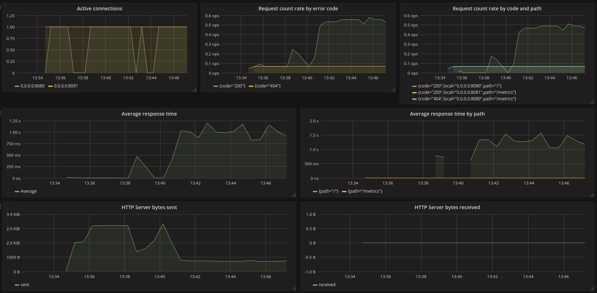
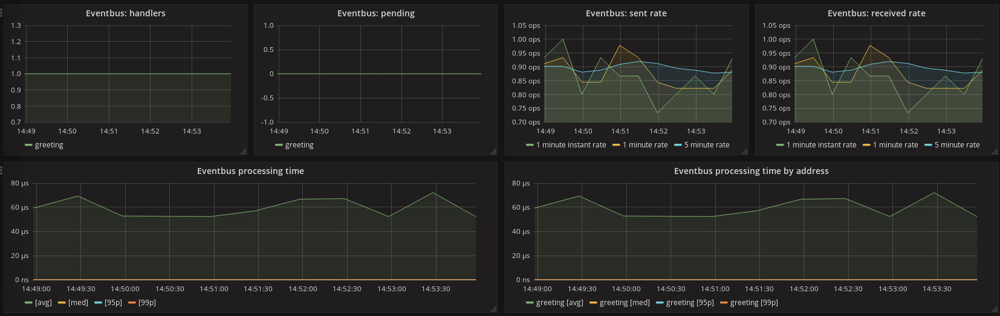

= Vert.x Micrometer Metrics examples

This project shows simple examples using the Vert.x Micrometer Metrics module.

There are examples for _Prometheus_, _InfluxDB_ and _JMX_ backends.
Each of them deploys 3 verticles:

* `SimpleWebServer`, which creates an HTTP server - visit http://localhost:8080/ to trigger requests.
* `EventbusProducer`, which sends messages over the event bus
* `EventbusConsumer`, which receives event bus messages

Each of them simulates a random processing time.

For _Prometheus_, the verticle `WebServerForBoundPrometheus` is an alternative of `SimpleWebserver`
that allows to bind the prometheus `/metrics` endpoint to an existing HTTP server.

== Launching the example from the command line

First, build the fat jar:
```bash
mvn clean package
```

Then run any of these Main classes:

=== Prometheus

Note: link:https://prometheus.io/docs/prometheus/latest/getting_started/[check here] for Prometheus getting started guide.

```bash
java -cp target/micrometer-metrics-examples-3.5.1-fat.jar io.vertx.example.micrometer.prometheus.Main
```

The prometheus server must be configured with a scrape configuration to localhost:8081

```yaml
  - job_name: 'vertx-8081'
    static_configs:
      - targets: ['localhost:8081']
```

=== Prometheus with endpoint bound to existing server

```bash
java -cp target/micrometer-metrics-examples-3.5.1-fat.jar io.vertx.example.micrometer.ometheus.MainWithBoundPrometheus
```

The prometheus server must be configured with a scrape configuration to localhost:8080

```yaml
  - job_name: 'vertx-8080'
    static_configs:
      - targets: ['localhost:8080']
```

=== InfluxDB

This sample application expects an InfluxDB server running on localhost, port 8086, without authentication.
For quick setup, this docker command will run it:

```bash
docker run -p 8086:8086 influxdb
```

Start the application:
```bash
java -cp target/micrometer-metrics-examples-3.5.1-fat.jar io.vertx.example.micrometer.influxdb.Main
```

=== JMX

```bash
java -cp target/micrometer-metrics-examples-3.5.1-fat.jar io.vertx.example.micrometer.jmx.Main
```
Metrics will be available under domain `metrics`.

== Triggering some workload

You can trigger some workload to see the impact on HTTP server metrics:

```bash
while true
do curl http://localhost:8080/
    sleep .8
done
```

== View in Grafana

Metrics can be observed from Grafana. These dashboards track some HTTP server and event bus metrics:
link:http://grafana/Vertx-Prometheus.json[for Prometheus], link:http://grafana/Vertx-InfluxDB.json[for InfluxDB].

.HTTP server metrics


.Event bus metrics

