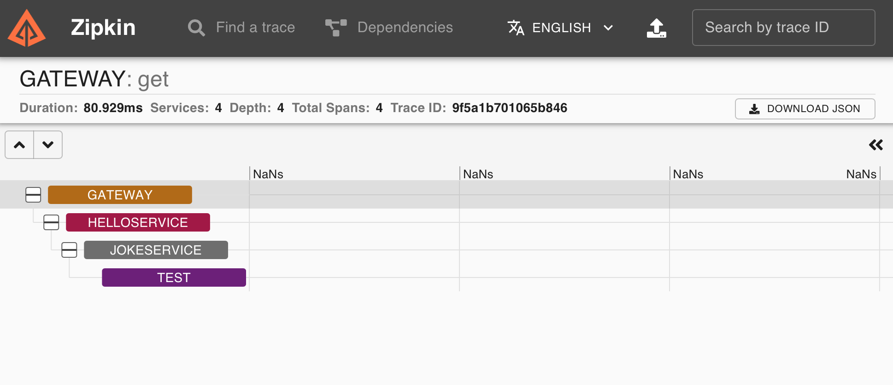

= Vert.x Zipkin example

Here you will find examples demonstrating Vert.x Zipkin in action.

Please consult the Vert.x Zipkin manual for the detailed documentation.

== Microservices

This example shows a couple of simple microservices monitored with Vert.x Zipkin

=== Joke service

The Joke service provides an HTTP microservice for jokes stored in a PostgreSQL.

The HTTP server and the database client contribute traces.

You can query this service with curl:

[source]
----
> curl http://localhost:8082
----

=== Hello service

The Hello service provides an HTTP microservice for saying hello. This service uses the Joke
service to tell the user a joke.

The HTTP server and the HTTP client contribute traces.

You can query this service with curl:

[source]
----
> curl http://localhost:8081
----

=== Gateway

The Gateway is a simple HTTP gateway that exposes both Joke and Hello services.

The HTTP server and the HTTP client contribute traces.

You can query this service with curl:

[source]
----
> curl http://localhost:8080/hello
> curl http://localhost:8080/joke
----

== Zipkin

You need to start an https://zipkin.io[Zipkin] server

[source]
----
> docker run -d -p 9411:9411 openzipkin/zipkin
----

Jaeger provides a visual http://localhost:9411/[console]

You can run the _Hello_, _Joke_ and _Gateway_ services in your IDE with link:src/main/java/io/vertx/example/zipkin/ZipkinExample.java[Zipkin Example]

Or you can start them separately:

- link:src/main/java/io/vertx/example/zipkin/Gateway.java[Gateway]
- link:src/main/java/io/vertx/example/zipkin/HelloService.java[Hello service]
- link:src/main/java/io/vertx/example/zipkin/JokeService.java[Joke service]
